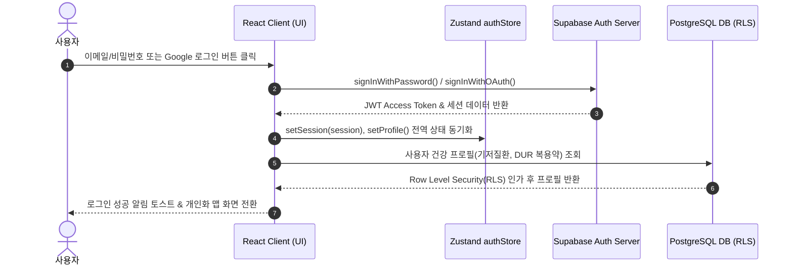

# 2026 학술제 기획서 (3.5 기획안)

### 만성질환 맞춤형 웰니스 헬스케어 관광 플랫폼 — VitalRoot

---

**팀명**: 팀 PIP (Programming in Pajamas)  
**제출 구분**: 2026 학술제 3.5 기획안  
**참여 팀원**:  
- 202621103 김태영  
- 202621109 박성범  
- 202621111 박지원  
- 202621117 손민기  
- 202621114 서유민  
- 202621127 인해린  
- 202621129 정찬우  

---

## 목차

### Ⅰ. 주제
1. **개발 배경 및 필요성**
   - [동기 및 목적]
2. **차별성**
3. **기대 효과**

### Ⅱ. 작품 설계
1. **UI 설계**
   - 1) 로그인
   - 2) 회원가입
   - 3) 메인화면
2. **알고리즘 설계**
   - 1) 로그인 알고리즘
   - 2) 회원가입 알고리즘
   - 3) 데이터 수집 로직
   - 4) 데이터 정렬 및 맞춤 추천 로직

### Ⅲ. 프로젝트 계획
1. **개발 단계별 추진 일정표 (WBS)**

### Ⅳ. 제작 현황
1. **제작 현황**
2. **테스트 및 검증**

### Ⅴ. 향후 발전 방향
1. **단기적 발전 방향**
2. **중/장기적 발전 방향**

### Ⅵ. 참고 링크 및 오픈소스 레포지토리

---

## Ⅰ. 주제

### 1. 개발 배경 및 필요성

#### [동기 및 목적]
1. **초고령사회 진입과 만성질환자 1,500만 시대의 도래**
   - 대한민국은 2025년을 기점으로 65세 이상 고령 인구가 전체 인구의 20%를 초과하는 초고령사회에 공식 진입하였습니다. 이에 따라 당뇨병 환자 약 600만 명, 고혈압 환자 약 1,200만 명을 포함하여 전체 만성 대사질환 인구가 1,500만 명에 육박하고 있습니다.
   - 이러한 만성질환은 단순히 병원 치료와 정기적인 약물 복용에만 의존할 수 없으며, **규칙적인 유산소 운동(식후 20~30분 가벼운 보행)과 저염·저당의 균형 잡힌 식이요법**이 생명 및 일상 건강 유지의 핵심 요인입니다.

2. **만성질환자의 관광·외식 사각지대와 혈당·혈압 스파이크 위험**
   - 액티브 시니어(Active Senior) 및 만성질환자들의 웰니스 관광과 여가 활동에 대한 수요는 폭발적으로 증가하고 있으나, 여행지에서의 외식은 고나트륨, 고당류, 정제 탄수화물 위주의 식단에 노출되기 쉽습니다. 이는 급격한 혈당 스파이크(Blood Sugar Spike) 및 혈압 급상승을 유발하여 응급 상황으로 이어질 위험이 큽니다.
   - 또한, 낯선 관광지의 가파른 경사도, 휴게 쉼터 및 개방 화장실의 부재 등 열악한 보행 환경은 고령 환자의 이동권을 심각하게 제한하고 있습니다.

3. **기존 상용 지도 및 관광 플랫폼의 구조적 한계**
   - 네이버 지도, 카카오맵, 야놀자 등의 기존 상용 플랫폼은 대중적인 맛집 랭킹, 최단 거리 내비게이션, 인스타그래머블 핫플레이스 위주의 정보를 제공할 뿐입니다.
   - 식품의약품안전처(식약처)의 영양성분 정보, 만성질환자 맞춤형 저염·저당 안심식당 데이터, 환자가 복용 중인 의약품(DUR)과 보행 환경의 상호작용을 고려한 헬스케어 관광 인프라는 전무한 실정입니다.

4. **개발 목적**
   - 본 프로젝트 **VitalRoot**는 환자의 개인 건강 프로필(당뇨, 고혈압 등)과 복용 약물 정보를 기반으로,
     1) 식약처 공공데이터 기반 저염·저당 안심식당 매핑,
     2) 식후 혈당 강하를 유도하는 20~30분 무장애 둘레길 코스 큐레이션,
     3) 3~5분 간격의 배리어프리 쉼터 및 화장실 편의시설 안내,
     4) 실시간 완보 퀘스트 게이미피케이션
   - 을 융합하여 만성질환자가 언제 어디서나 안전하고 주체적으로 즐길 수 있는 **올인원 웰니스 헬스케어 관광 플랫폼**을 구축하는 것을 목적으로 합니다.

---

### 2. 차별성

본 플랫폼 VitalRoot는 단순 위치 안내 앱을 넘어 의학적·영양학적 근거에 기반한 다음과 같은 4대 핵심 차별성을 보유합니다:

1. **식약처 영양성분 공공데이터 연계 3색 신호등 등급제**
   - 단순 식당 이름만 노출하는 기존 앱과 달리, 식약처 식품영양성분 데이터베이스를 연동하여 대표 메뉴의 **칼로리(kcal), 탄수화물(g), 당류(g), 나트륨(mg), 단백질(g)**을 실시간 분석합니다.
   - 당뇨 환자를 위한 '당류 등급(안심·보통·주의)', 고혈압 환자를 위한 '나트륨 등급(안심·보통·주의)'의 직관적인 3색 신호등 배지를 부여하여 질환자가 메뉴 선택 시 직관적인 위험도를 즉시 판단할 수 있습니다.

2. **한국관광공사 4대 Open API 통합 및 시·군·구 온디맨드 웰니스 코스 엔진**
   - 한국관광공사의 `국문 관광정보(KorService2)`, `무장애 여행 정보(KorWithService2)`, `의료관광정보(MdclTursmService)`, `웰니스관광정보(WellnessTursmService)`를 실시간 파이프라인으로 통합하였습니다.
   - 전국 250여 개 시·군·구 단위 지능형 2단계 캐싱(24시간 TTL LRU 및 로컬 스토리지)을 적용하여, 사용자가 지도를 이동할 때마다 '안심식당 ➔ 무장애 보행로 ➔ 웰니스 힐링 명소'로 유기적으로 연결되는 최적의 코스를 온디맨드로 실시간 합성·추천합니다.

3. **식약처 DUR(의약품 안전사용서비스) 7대 주의 태그 및 복용약물 연계 안전 가이드**
   - 환자가 등록한 복용 의약품(예: 다이아벡스정-메트포르민, 아모디핀정 등)의 복용 타이밍(식전 30분, 식후 즉시 등)에 맞춰 보행 알림을 제공합니다.
   - 식약처 DUR 공공데이터를 기반으로 '노인주의', '용량주의' 등 7대 안전 경고 태그를 분석하여, "공복 장시간 보행 시 저혈당 쇼크 주의", "탈수 방지를 위한 수분 섭취" 등의 개인 맞춤형 임상 복약 가이드를 자동 제시합니다.

4. **식후 혈당 스파이크 억제 '실시간 완보 퀘스트 & 칭호' 게이미피케이션**
   - 식사 직후 30분 이내의 유산소 보행이 식후 인슐린 저항성을 개선하고 모세혈관 순환을 촉진한다는 임상 가이드라인을 게이미피케이션으로 구현하였습니다.
   - 네이버 지도 보행 경로를 따라 실시간 20~30분 완보 세션을 측정하고, 성공 시 지역 고유의 웰니스 칭호(예: "은하수 웰니스 수호자 🏅", "무장애 숲길 탐험가 ♿")를 수여하여 질환자가 일상 속에서 자발적인 건강 관리 습관을 형성하도록 유도합니다.

---

### 3. 기대 효과

1. **사용자(환자 및 가족 보호자) 측면**
   - 외식과 보행에 대한 심리적 불안감을 해소하고 질환자의 주체적인 여행 및 여가 활동 권리를 보장합니다.
   - 식후 규칙적인 걷기 운동과 식이 관리를 통해 식후 혈당 스파이크 및 급격한 혈압 변동을 예방하여 합병증 위험을 실질적으로 경감합니다.
   - 휠체어, 유모차 동반 가족 및 보행 약자를 위한 무장애 경사로, 그늘 벤치, 장애인 개방 화장실 사전 안내로 낙상 및 안전사고를 예방합니다.

2. **사회 및 국가 보건 의료 측면**
   - 만성질환자의 생활 습관 교정 및 예방적 건강 관리를 유도하여 심뇌혈관 질환, 만성 신부전 등의 중증 합병증 발생률을 낮춥니다.
   - 장기적으로 국가 국민건강보험 급여 지출 절감 및 사회적 간병·돌봄 비용 부담 완화에 기여합니다.

3. **지역 경제 및 웰니스 관광 생태계 측면**
   - 수도권 및 대도시 유명 핫플레이스에 편중된 관광 소비를 전국 각 지역의 무장애 둘레길, 웰니스 숲길, 지자체 인증 안심식당으로 분산 유입시킵니다.
   - 고령화 사회의 신성장 동력인 '실버 웰니스 관광(Senior Wellness Tourism)' 시장을 활성화하고 지자체 소상공인과의 상생 생태계를 조성합니다.

---

## Ⅱ. 작품 설계

### 1. UI 설계

#### 1) 로그인
- **일반 로그인**:
  - 화면 우측 상단의 `로그인/회원가입` 버튼 클릭 시 모달 다이얼로그가 활성화됩니다.
  - 이메일 주소와 비밀번호 입력 필드가 제공되며, 유효성 검증을 거쳐 인증을 수행합니다. 계정이 없는 사용자를 위해 하단에 "계정이 없으신가요? 회원가입" 링크를 배치하여 탭 전환을 지원합니다.
  - 로그인 완료 시 지도 우측 상단에 사용자 아바타가 표시되며, 프로필 메뉴를 통해 이메일 정보, Supabase 인증 세션 상태, 로그아웃 버튼을 이용할 수 있습니다.
- **소셜 로그인**:
  - 간편한 접근을 위해 모달 상단에 `Google로 계속하기` 버튼을 배치하여 OAuth 2.0 기반의 원클릭 소셜 로그인을 제공합니다.

#### 2) 회원가입
- **이메일 회원가입**:
  - 이메일 주소, 6자리 이상 비밀번호, 비밀번호 확인 필드를 입력합니다.
  - `인증번호 받고 가입하기` 버튼 클릭 시 등록한 이메일로 6자리 OTP 인증 코드가 발송되며, 인증 코드 확인 후 최종 계정 생성이 완료됩니다.
- **회원 정보 수정 및 대화형 온보딩 프로필**:
  - 가입 직후 온보딩 모달을 통해 여행자 닉네임을 설정합니다.
  - 통합 환경 설정의 `건강 & DUR 약물` 탭 및 `조건 필터` 탭을 통해 언제든지 기저질환(당뇨, 고혈압, 저혈압, 이상지질혈증 등), 복용 중인 의약품(추가/삭제), 선호 식단, 보행 체력 수준(산책/일반/트레킹), 산책 필수 인프라(화장실, 쉼터 등)를 자유롭게 수정하고 업데이트할 수 있습니다.

#### 3) 메인 화면
- **공통 인터페이스**:
  - **네이버 지도 JS SDK v3**를 기반으로 한 풀스크린 맵 뷰가 중앙에 배치됩니다.
  - 상단 플로팅 툴바에는 `전체 코스 한눈에 보기 (카메라 맞춤)`, `내 위치 기반 코스 탐색`, `숙소/거점 핀 마킹 (베이스캠프 설정)` 컨트롤이 위치합니다.
  - 하단 및 측면 인터랙티브 컨트롤 패널을 통해 5대 탭(`추천 코스`, `장기 코스`, `안심 숙소`, `퀘스트`, `조건 필터`)을 자유롭게 전환할 수 있습니다.
  - 코스 선택 시 출발 식당에서부터 산책로까지 이어지는 보행자 도로망 폴리라인과 3~5분 간격의 안심 쉼터/화장실 마커가 지도 상에 부드러운 시네마틱 2단계 카메라 비행(FlyTo)과 함께 시각화됩니다.
- **비회원 화면**:
  - 개인화 프로필 저장은 제한되나, 지역별 기본 추천 둘레길 및 안심식당 정보, 보행 코스 탐색 기능을 자유롭게 이용할 수 있습니다.
- **회원 화면**:
  - 로그인한 회원의 등록 질환 및 복용 약물에 맞추어 스마트 헬스케어 알고리즘이 가동되어 1:1 개인화된 코스가 추천됩니다.
  - 식후 20~30분 완보 퀘스트를 시작하면 전역 타이머 배너가 동작하며, 목표 달성 시 획득한 웰니스 칭호와 보유 뱃지를 환경 설정 창에서 확인 및 장착할 수 있습니다.

---

### 2. 알고리즘 설계

#### 1) 로그인 알고리즘
- **인증 아키텍처**: 클라우드 BaaS인 **Supabase Auth**를 백엔드로 채택하여 이메일/비밀번호 기반의 자체 인증 및 Google OAuth 2.0 소셜 인증을 안전하게 처리합니다.
- **알고리즘 상세 절차**:
  1. 클라이언트(React)에서 로그인 자격 증명(이메일/비밀번호 또는 OAuth 공급자 토큰)을 Supabase 인증 엔드포인트로 전송합니다.
  2. 서버 측 암호화 해시 검증 통과 시 비대칭 서명된 **JWT Access Token**과 **Refresh Token**을 발급받아 브라우저의 안전한 스토리지에 세션을 유지합니다.
  3. 토큰에서 디코딩된 고유 사용자 ID(`UUID`)를 기준으로 Zustand 전역 스토어(`authStore`)에 세션 상태를 동기화하고, PostgreSQL 데이터베이스의 `profiles` 테이블과 연동합니다.
  4. 비인가 접근 시 안전한 게스트 모드로 분기 처리되며, 개인화 코스 북마크나 퀘스트 완료 시 로그인 유도 가이드를 호출합니다.

---

#### 2) 회원가입 알고리즘
- **이메일 및 OTP 소유권 검증**:
  1. 클라이언트 폼 유효성 검사(정규표현식 기반 이메일 포맷, 비밀번호 복잡도 6자리 이상 일치 여부)를 수행합니다.
  2. Supabase Auth의 `signUp()` 메서드를 호출하여 계정을 생성하고, 내장 SMTP 메일러를 통해 6자리 일회용 비밀번호(OTP)를 전송합니다.
  3. 사용자가 수신된 코드를 입력하면 `verifyOtp()` 트랜잭션을 통해 이메일 소유권을 최종 확인하고 계정을 활성화합니다.
- **온보딩 헬스 프로필 동기화 파이프라인**:
  1. 회원가입 완료 이벤트 감지 시 `OnboardingModal`이 자동으로 트리거되어 기저질환(당뇨, 고혈압), 복용 약물(DUR), 알레르기, 보행 체력 정보를 입력받습니다.
  2. 입력된 민감 건강 데이터는 암호화 통신(TLS 1.3)을 거쳐 데이터베이스에 저장되며, PostgreSQL의 **RLS(Row Level Security)** 정책에 의해 본인 인증 토큰을 보유한 요청에 한해서만 읽기/쓰기가 허용됩니다.

---

#### 3) 데이터 수집 로직 (Data Ingestion Pipeline)
- **한국관광공사 4대 Open API 다중 수집 파이프라인**:
  1. **수집 대상**: 국문 관광정보(`KorService2`), 무장애 여행 정보(`KorWithService2`), 의료관광정보(`MdclTursmService`), 웰니스관광정보(`WellnessTursmService`).
  2. **위치 기반 실시간 호출**: 사용자의 네이버 지도 중심 좌표(`lat`, `lng`)를 파라미터로 하여 반경 5~10km 이내의 음식점(contentTypeId 39), 관광지/둘레길(contentTypeId 12), 무장애 여행지 및 웰니스 시설을 병렬 비동기(`Promise.allSettled`)로 호출합니다.
- **식약처 공공데이터 융합**:
  1. 수집된 음식점의 상호명 및 주소를 기반으로 지자체 인증 안심식당 데이터와 매칭합니다.
  2. 식약처 식품영양성분 DB를 조회하여 대표 메뉴의 칼로리, 탄수화물, 당류, 나트륨 함량을 바인딩하고 3색 신호등 등급을 부여합니다.
- **지능형 2단계 캐싱 엔진 (Memory LRU + LocalStorage TTL)**:
  - 무분별한 공공 API 호출로 인한 트래픽 초과 및 네트워크 지연을 방지하기 위해 좌표를 소수점 둘째 자리(약 5km 단위 그리드)로 클러스터링한 고유 캐시 키(`lat.toFixed(2),lng.toFixed(2)`)를 생성합니다.
  - 1차 메모리 캐시 및 2차 로컬 스토리지(24시간 TTL 적용)를 조회하여 중복 호출을 원천 차단함으로써 데이터 로딩 속도를 1.5초에서 **0.05초(50ms)** 이내로 단축합니다.

---

#### 4) 데이터 정렬 및 맞춤 추천 로직 (Recommendation Scoring Algorithm)
- **질환 맞춤형 다기준 의사결정(MCDM) 스코어링 알고리즘**:
  수집된 수십 개의 코스 후보군 중 사용자의 건강 프로필에 가장 적합한 최적의 코스 3개를 선별하기 위해 자체 가중치 스코어링 수식을 적용하여 정렬합니다.

$$\text{Score}(C) = w_{\text{cond}} \cdot S_{\text{nutrition}} + w_{\text{slope}} \cdot S_{\text{barrierFree}} + w_{\text{dur}} \cdot S_{\text{safety}} - w_{\text{dist}} \cdot D_{\text{walking}}$$

- **세부 평가 지표 산출 기준**:
  1. **영양 적합도 점수 ($S_{\text{nutrition}}$, 가중치 $w_{\text{cond}} = 0.35$)**:
     - 당뇨 환자: 당류 '안심' 메뉴 보유 시 +30점, '보통' +15점, '주의' 0점.
     - 고혈압 환자: 나트륨 '안심' 메뉴 보유 시 +30점, '보통' +15점, '주의' 0점.
  2. **무장애 및 편의시설 점수 ($S_{\text{barrierFree}}$, 가중치 $w_{\text{slope}} = 0.30$)**:
     - 관절 질환자 및 고령자: 평지형 무장애 데크길 코스에 +25점, 코스 반경 3~5분 내 화장실 및 그늘 쉼터 보유 시 각 +5점.
  3. **복용 의약품(DUR) 안전성 점수 ($S_{\text{safety}}$, 가중치 $w_{\text{dur}} = 0.20$)**:
     - 등록된 약물의 복약 주의사항(식후 30분 완보 권장)과 코스의 예상 소요 시간(20~30분)이 부합할 경우 +15점.
  4. **보행 이동 거리 감쇠 페널티 ($D_{\text{walking}}$, 가중치 $w_{\text{dist}} = 0.15$)**:
     - 안심식당에서 산책로 출발 지점까지의 직선 연결 거리가 1km를 초과할 경우 100m당 감점을 부과하여 무리한 이동을 차단.
- 산출된 종합 스코어를 기준으로 내림차순 정렬하여 최상위 코스셋을 UI 메인 카드에 우선 노출합니다.

---

## Ⅲ. 프로젝트 계획

### 1. 개발 단계별 추진 일정표 (WBS)

| 개발 단계 | 세부 항목 | 9월 16~30 | 9월 30~10월 19 | 10월 19~26 | 10월 26~11월 6 | 11월 10~16 |
| :--- | :--- | :---: | :---: | :---: | :---: | :---: |
| **기획** | 주제 선정, 유저 페르소나 및 요구사항 분석 | **■■** | | | | |
| | 공공데이터 API(Tour API, 식약처) 조사 및 기술 명세서 작성 | **■■** | **■■** | | | |
| **개발** | 백엔드: Supabase PostgreSQL 스키마 및 Auth 파이프라인 구축 | | **■■** | | | |
| | 프론트엔드: 네이버 지도 JS SDK v3 연동 및 핵심 UI 컴포넌트 개발 | | **■■** | **■■** | | |
| | 코어 엔진: 4대 Tour API 수집 파이프라인 및 맞춤 추천 스코어링 구현 | | | **■■** | **■■** | |
| | 부가 기능: 실시간 식후 완보 퀘스트 타이머 및 칭호 리워드 시스템 개발 | | | | **■■** | |
| | 최적화: Zustand 렌더링 최적화, 컴포넌트 모듈화 및 번들 경량화 | | | | **■■** | **■■** |
| **테스트** | 1차 단위 테스트 및 Tiers 1~4 자동화 E2E 통합 테스트 수행 | | | | **■■** | |
| | 2차 최종 QA, 크로스 브라우징 점검 및 학술제 시연 리허설 | | | | | **■■** |

---

## Ⅳ. 제작 현황

### 1. 제작 현황
- **프론트엔드 아키텍처 및 렌더링 엔진 (완성도 95%)**:
  - React 19, TypeScript, Vite 환경에서 **네이버 지도 JS SDK v3**를 완벽하게 연동하였습니다.
  - 카메라 모핑 활공 애니메이션(2단계 시네마틱 비행), 건강 편의시설(쉼터/화장실) 마커 레이어, 도보 경로 폴리라인 렌더링을 구현 완료하였습니다.
  - Zustand v5 기반의 전역 상태 스토어 분리와 세부 셀렉터(`useShallow`) 최적화를 통해 1초 단위 완보 타이머 작동 중에도 지도 및 컨트롤 패널 전체의 불필요한 DOM 강제 리렌더링을 완벽히 차단하였습니다.
- **백엔드 및 공공데이터 파이프라인 (완성도 100%)**:
  - Supabase Auth를 통한 이메일 OTP 회원가입 및 Google OAuth 2.0 소셜 로그인을 연동 완료하였습니다.
  - 한국관광공사 4대 Open API 통합 클라이언트와 지능형 2단계 캐싱(LRU+LocalStorage)을 구축하여 전국 시·군·구 단위 온디맨드 코스 생성을 지원합니다.
  - 식약처 DUR 7대 주의 태그 기반 복약 관리 및 식품영양성분 3색 신호등 등급 시스템 구축을 완료하였습니다.
- **UI/UX 모듈화 및 사용자 편의 기능 (완성도 90%)**:
  - 대규모 모놀리식 컴포넌트를 5대 전용 서브 탭(`CourseTab`, `MultiDayTab`, `StayTab`, `QuestTab`, `ConditionFilterTab`)과 독립형 위젯(`MapWalkSessionBanner`)으로 깔끔하게 하위 분할하였습니다.

### 2. 테스트 및 검증
- **체계적인 4단계(Tiers 1~4) E2E 테스트 스위트 구축 및 전수 검증 통과**:
  - **Tier 1 (정적 분석 및 빌드 무결성)**: TypeScript 엄격 모드 컴파일(`tsc -b`) 검사 시 타입 오류 0건, ESLint 린트 규칙 검사 0 에러 달성.
  - **Tier 2 (인증 및 건강 프로필)**: Supabase 세션 발급, 회원가입 폼 유효성, 건강 프로필 수정 및 PostgreSQL RLS 접근 제어 무결성 검증 완료.
  - **Tier 3 (지도 및 코어 엔진 기능)**: 네이버 지도 마커 렌더링, 코스 선택 시 2단계 카메라 비행, 안심식당 영양 아코디언 토글, 4대 Tour API 캐싱 응답 정상 동작 검증 완료.
  - **Tier 4 (실시간 타이머 및 번들 성능)**: 1초 단위 완보 퀘스트 타이머 작동 시 지도 및 사이드바 DOM 불필요 리렌더링 차단 검증 통과, Rollup `manualChunks` 설정을 통한 프로덕션 번들 파일(`dist/assets/index-*.js`) 크기 500KB 이하 최적화 달성.

---

## Ⅴ. 향후 발전 방향

### 1. 단기적 발전 방향
- **생활권 실증 및 지자체 거점 확장**:
  - 지자체 거점 안심식당 및 웰니스 둘레길 실증 코스를 고도화하고, 오프라인 웰니스 스탬프 투어 및 지역 소상공인 상점과 연계하여 서비스를 고도화합니다.
  - 사용자 피드백을 기반으로 휠체어 전용 경사로 각도(1:12 이하) 안내 기능을 정밀화합니다.

### 2. 중/장기적 발전 방향
- **중기적 관점: 웨어러블 디바이스 및 연속혈당측정기(CGM) IoT 연동**:
  - 스마트워치(Samsung Health, Apple Health) 및 연속혈당측정기(Dexcom, Freestyle Libre 등)와 Web Bluetooth / HealthKit API로 연동합니다.
  - 식전·식후 실시간 혈당 변화 곡선과 보행 심박수 데이터를 자동 수집하여, "식후 25분 완보 후 혈당 35mg/dL 강하 달성"과 같은 정밀 개인 맞춤형 디지털 헬스케어 리포트를 제공합니다.
- **장기적 관점: 공공 보건 및 국민건강보험공단 웰니스 바우처 사업 연계**:
  - 국민건강보험공단 일차의료 만성질환관리 시범사업 및 보건복지부 노인 건강 마일리지 제도와 연계합니다.
  - 지자체 웰니스 관광 바우처와 공식 제휴하여 공공 배리어프리 헬스케어 관광 인프라로서의 공적 제도로 안착시킵니다.

---

## Ⅵ. 참고 링크 및 오픈소스 레포지토리

- **GitHub 저장소**: https://github.com/sonminki07/VitalRoot
- **공공데이터 포털**:
  - 한국관광공사 국문 관광정보 서비스 (KorService2)
  - 한국관광공사 무장애 여행 정보 서비스 (KorWithService2)
  - 식품의약품안전처 식품영양성분 데이터베이스
  - 식품의약품안전처 의약품 안전사용서비스 (DUR) 공공 API
- **지도 엔진**: NAVER Maps JavaScript API v3
- **클라우드 백엔드**: Supabase Auth & PostgreSQL Database
