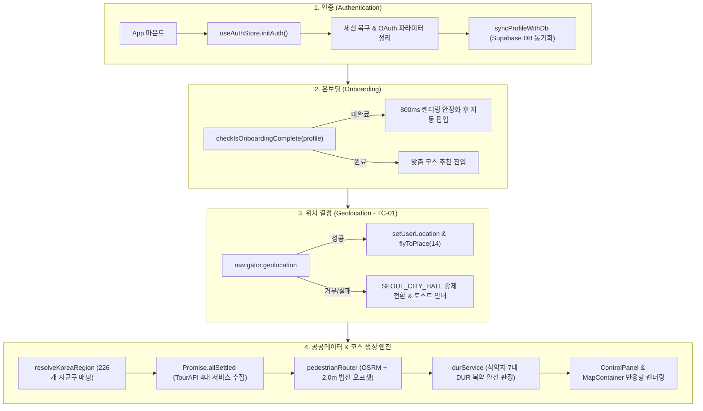

# 🌿 VitalRoot 코드베이스 아키텍처 & 팀원 인수인계 가이드

본 문서는 **사전 지식이 없는 신규 팀원**이 VitalRoot 프로젝트의 전체 코드 구조, 데이터 흐름, 핵심 알고리즘 및 주석 체계를 즉시 파악하고 개발에 참여할 수 있도록 정리한 종합 가이드입니다.

---

## 1. 🏗️ 전체 시스템 아키텍처 & 4단계 데이터 파이프라인



---

## 2. 📁 디렉터리별 핵심 역할 및 파일 가이드

### ① 진입점 & 최상위 제어
* **[`src/main.tsx`](file:///D:/VitalRoot-main/VitalRoot-main/src/main.tsx)**: React 18+ createRoot 렌더러, StrictMode 환경 검증, 루트 `App` 컴포넌트 마운트 라인별 주석 완비.
* **[`src/App.tsx`](file:///D:/VitalRoot-main/VitalRoot-main/src/App.tsx)**: 전역 Supabase 세션 리스너, 커스텀 이벤트(`vital-auth-required`), TC-01 위치 권한 fallback, 온보딩 자동 팝업, 전역 모달 레이아웃 관리.

### ② 전역 상태 관리 (Zustand Stores)
* **[`src/store/mapStore.ts`](file:///D:/VitalRoot-main/VitalRoot-main/src/store/mapStore.ts)**: 네이버 지도 중심 좌표, 줌 레벨, 3D 틸트/방위각, `flyToPlace` 부드러운 카메라 비행 상태 관리.
* **[`src/store/authStore.ts`](file:///D:/VitalRoot-main/VitalRoot-main/src/store/authStore.ts)**: Supabase 소셜 로그인(Google), 이메일 OTP 가입, 모달 상태 머신(`authTab`, `authStep`, `authView`), 세션 캐시 리셋.
* **[`src/store/wellnessStore.ts`](file:///D:/VitalRoot-main/VitalRoot-main/src/store/wellnessStore.ts)**: 만성질환 6대 분류 맞춤 필터, 공공데이터 온디맨드 로딩, 실시간 완보 걷기 세션 타이머, 로컬스토리지 영구 동기화.

### ③ 지도 & UI 컴포넌트
* **[`src/components/map/MapContainer.tsx`](file:///D:/VitalRoot-main/VitalRoot-main/src/components/map/MapContainer.tsx)**: 네이버 지도 인스턴스 라이프사이클(초기화/해제), 내 집 핀 찍기 클릭 이벤트, OSRM 도보 경로 호출, 시네마틱 카메라 비행 컨트롤러.
* **[`src/components/map/layers/MapPolylinesLayer.tsx`](file:///D:/VitalRoot-main/VitalRoot-main/src/components/map/layers/MapPolylinesLayer.tsx)**: 실시간 완보 진척도 기반 경로 분할(지나온 길: 회색 점선 / 남은 길: 에메랄드 실선), 호버 프리뷰(보라색 점선).
* **[`src/components/map/layers/MapMarkersLayer.tsx`](file:///D:/VitalRoot-main/VitalRoot-main/src/components/map/layers/MapMarkersLayer.tsx)**: 70m 근접 마커 겹침 방지 필터링(무장애/의료 거점 영구 보호), 커스텀 HTML 마커, 사이드바 카드 클릭 시 150ms 지연 자동 인포윈도우 팝업.
* **[`src/components/panels/ControlPanel.tsx`](file:///D:/VitalRoot-main/VitalRoot-main/src/components/panels/ControlPanel.tsx)**: 데스크톱 3방향(가로/세로/대각선) 리사이즈 핸들러, 5개 메인 탭(추천코스, 장기코스, 안심숙소, 퀘스트, 조건필터), 식약처 DUR 카드 연동.

### ④ 공공데이터 API & 핵심 도메인 유틸
* **[`src/utils/pedestrianRouter.ts`](file:///D:/VitalRoot-main/VitalRoot-main/src/utils/pedestrianRouter.ts)**: WGS84 좌표계 미터 투영 상수(경도: 88,000m, 위도: 111,000m), 우측 2.0m 인도 법선 벡터 오프셋, 2-Pass 가중 이동평균(0.25, 0.5, 0.25), L자형 격자 보간(0.8/0.2) 및 도심 맨해튼 1.25배 우회율.
* **[`src/utils/durService.ts`](file:///D:/VitalRoot-main/VitalRoot-main/src/utils/durService.ts)**: 식약처 7대 DUR 카테고리(병용금기, 임부금기, 노인주의 등) 비동기 판정, 공공 API 파라미터 비대칭 규격 대응(`usjntTaboo`만 `ingrKorName`), 15대 만성질환 약물 로컬 마스터 데이터.
* **[`src/types/contract.types.ts`](file:///D:/VitalRoot-main/VitalRoot-main/src/types/contract.types.ts)** vs **[`src/types/wellness.types.ts`](file:///D:/VitalRoot-main/VitalRoot-main/src/types/wellness.types.ts)**: 통신 DTO(단일 진실 공급원)와 프론트엔드 UI/도메인 모델의 역할 분담 규약.

---

## 3. 🧪 핵심 알고리즘 상세 해설

### (1) 보행자 인도(Sidewalk) 법선 오프셋 & 2-Pass 스무딩
차량용 도로망 좌표를 보행자용 산책로로 변환할 때 차도 한가운데를 걷는 현상을 방지하기 위해 다음 기하 공식을 적용합니다:
```typescript
// 1. 위경도 -> 미터 단위 벡터 변환 (위도 37.5도 기준)
const dxMeters = (next[0] - prev[0]) * 88000;
const dyMeters = (next[1] - prev[1]) * 111000;
const segLen = Math.hypot(dxMeters, dyMeters);

// 2. 우측 보행로 방향 단위 법선 벡터 산출 및 2.0m 오프셋
const nx = dyMeters / segLen;
const ny = -dxMeters / segLen;
const offsetLng = (nx * 2.0) / 88000;
const offsetLat = (ny * 2.0) / 111000;

// 3. 3점 가중 이동평균 2-Pass 필터 (고주파 꺾임 제거)
const smoothLng = 0.25 * prev[0] + 0.5 * curr[0] + 0.25 * next[0];
const smoothLat = 0.25 * prev[1] + 0.5 * curr[1] + 0.25 * next[1];
```

### (2) 70m 근접 마커 클러스터링 & 무장애/의료 거점 보호
* 비활성 코스의 마커가 활성 코스 마커와 70m 이내로 겹칠 경우 지도 가독성을 위해 마커를 숨깁니다.
* **예외 보호 규칙**: 이름이나 태그에 `박물관`, `무장애`, `휠체어`, `의료`, `병원`이 포함된 장소는 거리에 상관없이 항상 노출되어 안전망을 보장합니다.

---

## 4. 🚀 개발 및 로컬 실행 명령
```powershell
# 개발 서버 구동 (Vite HMR)
cd D:\VitalRoot-main\VitalRoot-main
npm run dev

# 타입 검사 및 프로덕션 번들 빌드
npm run build
```
